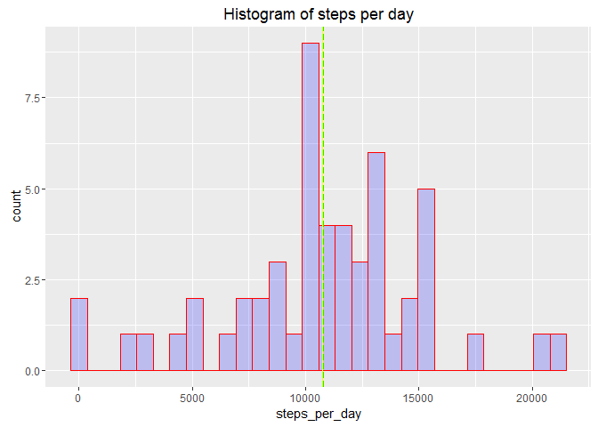
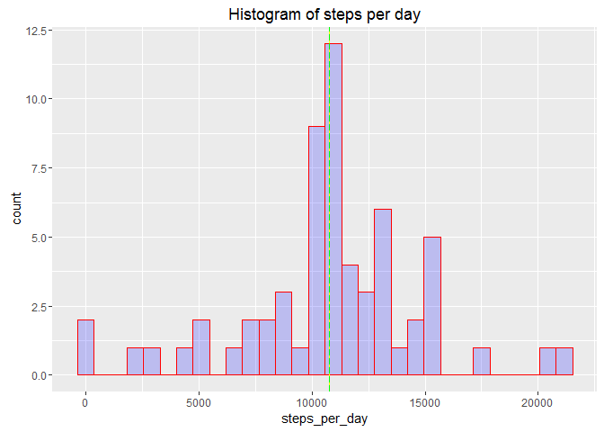
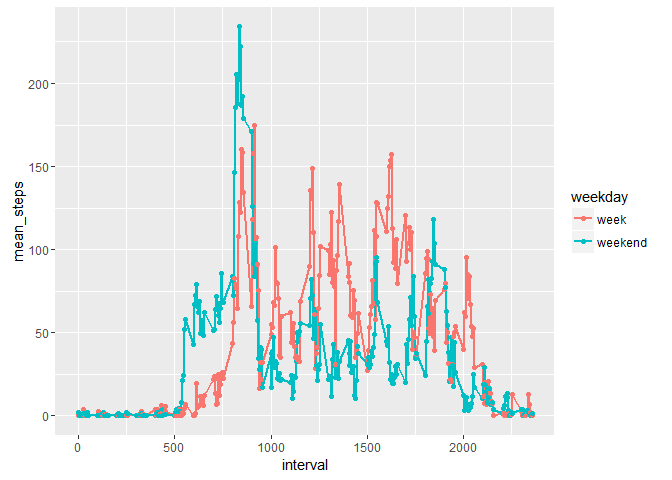

# Reproducible Research: Peer Assessment 1


## Loading and preprocessing the data
Let's load and explore the data

```r
dframe <- read.csv('activity.csv', header = TRUE)
str(dframe)
```

```
## 'data.frame':	17568 obs. of  3 variables:
##  $ steps   : int  NA NA NA NA NA NA NA NA NA NA ...
##  $ date    : Factor w/ 61 levels "2012-10-01","2012-10-02",..: 1 1 1 1 1 1 1 1 1 1 ...
##  $ interval: int  0 5 10 15 20 25 30 35 40 45 ...
```

```r
head(dframe)
```

```
##   steps       date interval
## 1    NA 2012-10-01        0
## 2    NA 2012-10-01        5
## 3    NA 2012-10-01       10
## 4    NA 2012-10-01       15
## 5    NA 2012-10-01       20
## 6    NA 2012-10-01       25
```


## What is mean total number of steps taken per day?


```r
library(dplyr);
library(ggplot2);
data_days_prev <- group_by(dframe,date);
data_days <- summarize(data_days_prev,steps=sum(steps));
mean_steps_per_day <- mean(data_days$steps, na.rm=TRUE);
median_steps_per_day<- median(data_days$steps, na.rm=TRUE);
p <- qplot(data_days$steps,fill=I('blue'), xlab='steps_per_day', col=I('red'),alpha=I(.2),main='Histogram of steps per day') 
p<- p + geom_vline(xintercept = median_steps_per_day,colour="yellow")
p <- p + geom_vline(xintercept = mean_steps_per_day,colour="green", linetype = "longdash")
cat('the mean steps per day is ', mean_steps_per_day)
```

```
## the mean steps per day is  10766.19
```

```r
cat('the median steps per day is ', median_steps_per_day)
```

```
## the median steps per day is  10765
```

```r
p
```

 

## What is the average daily activity pattern?

```r
data_interval_prev <- group_by(dframe,interval)
data_interval <- summarize(data_interval_prev,steps=mean(steps,na.rm=TRUE))
plot(data_interval$interval, data_interval$steps, type='l', col='blue', xlab='interval',ylab='steps')
```

 


```r
cat('The interval with most steps in average is ', data_interval[data_interval$steps==max(data_interval$steps),]$interval, ' with ', data_interval[data_interval$steps==max(data_interval$steps),]$steps, 'steps');
```

```
## The interval with most steps in average is  835  with  206.1698 steps
```
## Imputing missing values


```r
cat('There are in total ', sum(is.na(dframe$steps)), 'intervals without data')
```

```
## There are in total  2304 intervals without data
```
We now insert in these intervals the average number of steps calculated for that specific interval in other days.

```r
dframe_full<-dframe;
for (il in seq(0,max(dframe$interval),5))
  {dframe_full[dframe$interval==il & is.na(dframe$steps),'steps'] <- data_interval[data_interval$interval==il,'steps']}
```
We now look at the histogram, mean and median, to check if data looks similar as before

```r
datafull_days_prev <- group_by(dframe_full,date)
datafull_days <- summarize(datafull_days_prev,steps=sum(steps))
mean_steps_per_day_full <- mean(datafull_days$steps, na.rm=TRUE)
median_steps_per_day_full<- median(datafull_days$steps, na.rm=TRUE)
p <- qplot(datafull_days$steps,fill=I('blue'), xlab='steps_per_day', col=I('red'),alpha=I(.2),main='Histogram of steps per day') 
p<- p + geom_vline(xintercept = median_steps_per_day_full,colour="yellow")
p <- p + geom_vline(xintercept = mean_steps_per_day_full,colour="green", linetype = "longdash")
data_days$steps[is.na(data_days$steps)] <- mean_steps_per_day*rep(1,sum(is.na(data_days$steps)))
cat('the new mean is ', mean_steps_per_day_full, ' and the new median is ', median_steps_per_day_full)
```

```
## the new mean is  10766.19  and the new median is  10766.19
```

```r
p
```

 

The distribution of steps per day did not change much except for the fact that it gained weight in the mean, moving the median to the mean.

## Are there differences in activity patterns between weekdays and weekends?

```r
dframe <- mutate(dframe, weekday=ifelse(weekdays(as.Date(date)) %in% c('Sunday','Saturday'),'week','weekend'))
head(dframe)
```

```
##   steps       date interval weekday
## 1    NA 2012-10-01        0 weekend
## 2    NA 2012-10-01        5 weekend
## 3    NA 2012-10-01       10 weekend
## 4    NA 2012-10-01       15 weekend
## 5    NA 2012-10-01       20 weekend
## 6    NA 2012-10-01       25 weekend
```

```r
data_interval_weekday_prev <- group_by(dframe,interval,weekday)
data_interval_weekday <- summarize(data_interval_weekday_prev,steps=mean(steps,na.rm=TRUE))

p <- ggplot(data_interval_weekday, aes(x=data_interval_weekday$interval, 
                                       y=data_interval_weekday$steps, 
                                       group = data_interval_weekday$weekday,
                                       colour=weekday)
            )
p + geom_line(size=1) +labs(x='interval', y='mean_steps') +geom_point()
```

 

The steps are more even during weekdays, with some peaks around the intervals 900, 1300, and 1700. During weekends there is a prominent peak around interval 800.

